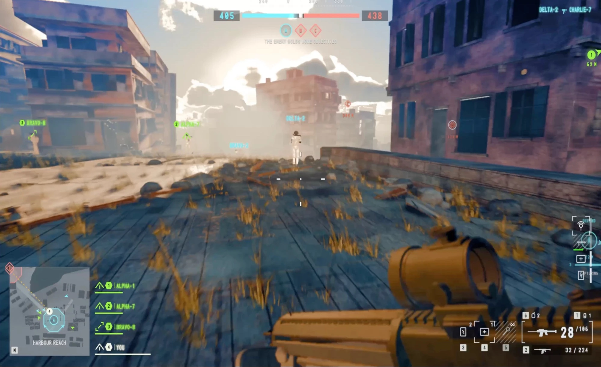

# IRONSIGHT

A browser-native first-person shooter built on Three.js — one map, Conquest, bots, destructible
cover — aiming at the visual and tactile bar of a modern AAA military shooter.



**▶ Play it in your browser: [ironsight-tan.vercel.app](https://ironsight-tan.vercel.app)** — desktop
Chrome or Edge, and give it ~30–60 s to bake on first load.

**Everything in that frame is generated procedurally in code at load time.** No textures, no meshes,
no audio files, no fonts. The repo contains **zero binary art assets** and the game makes **zero
network requests at runtime** — the terrain, the buildings, the grass, the sky, the weapon model, the
HUD's font atlas and every sound are all built on your machine in the first ~30–60 s. The shipped
bundle is three JavaScript files and an HTML page.

(The deployed site also serves `og.jpg`, the social-preview screenshot, and an SVG favicon. Neither
is loaded by the game — the "zero art assets" property is about what the renderer consumes, and it
holds exactly.)

MIT licensed. Contributions welcome — but read [Current state](#current-state--read-this-before-judging-it) first.

---

## Play it

```bash
npm install
npm run dev
```

Open the URL Vite prints (default <http://localhost:5173>), wait for the bake, then **click the
canvas to lock the pointer**. `Esc` releases it.

> Requires a WebGL2 browser. Chrome/Edge give the best results; Safari works but is slower.
> Nothing to configure for Node — the scripts route through `tools/with-node.sh`, which finds a
> Node ≥ 20.19 itself. Override with `IRONSIGHT_NODE_BIN`.

### Learn it — the JAMStack academy

The repo also ships **The Chronicle of Harbour Reach**, an interactive teaching site at `/learn/`
(same dev server, second Vite entry). Five chapters teach the JAMStack — JavaScript, APIs, Markup —
by building a civilization from a single seed: deterministic randomness, procedural terrain,
tick-stepped agents, build-time data, and the entropy-containing test loop, each as a live seeded
demo backed by the engine's own infrastructure. See [`docs/TEACHING.md`](docs/TEACHING.md) for the
why and the roadmap. Capture its deterministic screenshots with `npm run learn:shots`.

After the five academy missions, open **`/forge/`** for the Civilization Forge. A learner changes a
civilization, sigil, era, and named place; the browser publishes those choices as a URL contract.
Following the generated link boots the actual FPS, where the real minimap and objective markers use
the authored names. The `/?teach=1` overlay listens to real player movement, weapon, damage,
destruction, and capture-point data; it does not pose a lesson-sized simulation or award progress
for merely viewing a page. See [`docs/VIDEO_ANALYSIS.md`](docs/VIDEO_ANALYSIS.md) for recorded
gameplay evidence and the remaining unproven human outcomes.

```bash
npm run teach:smoke   # forge → authored game → movement, firing, and damage proof
```

### Controls

| | |
|---|---|
| **Move** | `W` `A` `S` `D` |
| **Look** | Mouse (click canvas to capture) |
| **Fire** | Left mouse |
| **Aim down sights** | Right mouse (hold) |
| **Sprint** | `Shift` |
| **Jump / vault** | `Space` |
| **Crouch** | `Ctrl` or `C` |
| **Prone** | `Z` |
| **Reload** | `R` |
| **Lean left / right** | `Q` / `E` |
| **Throw grenade** | `G` (hold to cook, release to throw) — 3 frags |
| **Use / interact** | `F` — resupply at an ammo crate on any capture point |
| **Fire mode** | `B` |
| **Spot** | `T` |
| **Scoreboard** | `Tab` (hold) |
| **Spawn / deploy menu** | `M` |

Gamepad is supported on the standard W3C mapping.

**Bound but inert:** `V` (melee) and `X` / `1`–`9` (weapon swap) reach the input layer, but nothing
consumes them yet. The loadout stays on the rifle.

### The map — HARBOUR REACH

A Mediterranean coastal town at golden hour. Three capture points:

- **ALPHA** — the market square, under the arcade
- **BRAVO** — the harbour cranes and quay
- **CHARLIE** — the old fort on the headland

### What is and isn't a playable mechanic

Some systems are fully built and visible in captured shots but **cannot be triggered by a player**.
Being explicit so the screenshots don't oversell the game. This table was re-measured by driving the
shipped build in a browser with real keyboard and mouse events and reading the counters back — not
by reading the code.

| System | Built? | Reachable in play? |
|---|---|---|
| Bullet impacts, decals, surface-correct debris | yes | **yes** |
| Destructible cover (geometry vanishes, shards, dust) | yes | **yes** — a frag breaches wood, stucco and sandbag cover; 18 shards per collapse. Masonry and concrete are currently too tough to breach in play (10+ frags, still intact) |
| Explosions (fireball, pressure ring, debris, smoke column) | yes | **yes** — `G` throws a frag that arcs, bounces, detonates and lights the world |
| HUD combat feedback (hitmarkers, killfeed, damage chips, kill banner) | yes | **yes** — driven by real `damage.applied` / `killfeed` events, not a demo timeline |
| Ammo resupply | yes | **yes** — a crate on each capture point; `F` or a short dwell |
| Bot combat | yes | **yes** — bots path, engage and kill each other; 2–6 kills per 60 s in a 9v9 soak |
| Melee | no | **no** — `V` reaches the input layer and nothing consumes it |

#### The trap that makes this table hard to check

`DestructionService.reset()` clears its registration table, and only `PhysicsService.addStatic` ever
repopulates it, at world build. That reset runs at the top of every `tools/shoot.sh` capture **and**
every `tools/soak.sh` run — so **inside both of this repo's automated instruments, every wall in the
map is an inert static collider**, and neither can see destruction at all. Live play never resets, so
a human is unaffected.

This burned us for most of the project: twelve rounds of critique scored destruction frames no player
could have caused. **Any claim about destruction has to be measured in a live page.**
`globalThis.__DESTR__` is the readout — `summary()` reports how many destructibles have geometry
attached, `nearby(point, radius)` pairs each one's `intact` flag with whether it is still `drawing`.
Same lane-private-probe pattern as `__THROWABLES__` and `__SOAK__`.

---

## Current state — read this before judging it

This project is **mid-development and does not yet meet its own quality bar.** Specifically:

- The engine, map, weapons, physics, bots, Conquest and HUD all work. 65 deterministic camera shots
  capture cleanly, and `npm run verify` is green.
- Against a rubric scored by **blind A/B comparison with real gameplay frames**, it sits well short
  of the AAA target — roughly **6.0 against an 8.5 bar**. [`docs/AAA_RUBRIC.md`](docs/AAA_RUBRIC.md)
  has the honest numbers and, importantly, explains why the absolute scores drift between rounds and
  should be read as deltas rather than levels.
- Known rough edges: over-strong near-field atmospheric scattering (a blue veil on several views),
  compressed contrast, sparse vegetation, and water that is weaker than the rest of the frame.

[`HANDOFF.md`](HANDOFF.md) is the full state-of-the-project document, including what to work on next
and the traps that will bite you.

---

## How it was built

IRONSIGHT was written almost entirely by orchestrated LLM subagents working in parallel lanes, with a
separate population of adversarial critic agents scoring the output against real gameplay footage.
The measured cost of that:

| | |
|---|---|
| **Subagents** | 203 |
| **Tokens generated** | ~16.9 M output (~6.2 B processed, ~95 % of it cache reads) |
| **API-equivalent compute** | ~$6.3 k at Opus 5 list rates |
| **Wall clock** | 55 hours |
| **Output** | 101,526 lines of TypeScript across 256 files, 4,881 lines of spec |

Three pieces of infrastructure did the actual work of keeping that many agents honest, and they are
the parts of this repo most likely to be useful to you even if you don't care about the game:

**A deterministic screenshot harness** ([`src/engine/harness.ts`](src/engine/harness.ts),
[`tools/capture.mjs`](tools/capture.mjs)). It suspends the render loop, reseeds the RNG, renders an
exact number of fixed-timestep frames and grabs the canvas. The frame budget is counted in **frames,
not wall-clock**, so a shot is reproducible frame-for-frame on any machine — which is what makes
"did this change make it look worse?" an answerable question.

**A boundary CI** ([`tools/check-boundaries.mjs`](tools/check-boundaries.mjs)). Parallel agents
writing into one renderer will quietly destroy it. This enforces cross-lane import bans, a
`Math.random()` ban (determinism), material-factory routing, wall-clock and network bans, and a set
of GLSL ES 3.00 bug classes that cost us real days — reserved words, implicit `int`→`float`, and
backticks inside template-literal shader source.

**A blind A/B critic loop** ([`tools/compare.sh`](tools/compare.sh)). Builds a two-panel sheet
labelled only **A** and **B**, sides randomised, answer key written to a directory critics are
forbidden to read. The blind is the entire point: it is very easy to rate your own work generously,
and we have the score deltas to prove it.

The single most valuable lesson is written up in `HANDOFF.md`: **the shot harness photographs
systems, not mechanics.** Twelve critic rounds scored an `ai_firefight` frame without ever noticing
that the bots did not move.

---

## Development

```bash
npm run verify       # app/functions types + boundaries + tests + production build
npm run dev          # Vite-only HMR; portable URL worlds still work
npm run netlify:dev  # Functions + local Database + Blob emulation on :8888
npm run build        # production build
npm run boundaries   # architectural rules only
```

The Civilization Forge at `/forge/` can publish a durable world through
`POST /api/worlds`, then open the actual game with a stable world ID. The full
URL-encoded profile always travels with that ID, so an API outage degrades to a
portable playable link rather than a dead world. Structured learner/world data
lives in Netlify Database; immutable evidence exports live in Netlify Blobs.
See the [environment and release runbook](docs/NETLIFY_RUNBOOK.md).

### Looking at the game without playing it

```bash
./tools/shoot.sh --list           # list every registered shot
./tools/shoot.sh level_bravo      # capture one → tools/shots/level_bravo.png  (~1.5 s)
./tools/shoot.sh                  # capture all
```

A green shoot doubles as a smoke test: it exits non-zero on a build failure, an uncaught page error
or any console error.

### Soak testing

```bash
./tools/soak.sh                   # headless fixed-timestep simulation
```

Reports distance travelled, frozen ticks and stuck ticks per bot. This is how the character
controller went from wedging on terrain 94.5 % of ticks to 2.5 %.

### Architecture in one paragraph

`src/engine/types.ts` is a ~3,500-line **contract layer** that every subsystem compiles against. Each
lane exposes exactly three named exports — `create*`, `register*Bakes`, `reset*` — and the
composition root that wires them is frozen. That is what made it safe to point a dozen agents at the
same renderer at once: the contract is negotiated up front, in a file that typechecks, so integration
failures surface as compile errors rather than as a black screen. See
[`docs/ARCHITECTURE.md`](docs/ARCHITECTURE.md) and [`docs/OWNERSHIP.md`](docs/OWNERSHIP.md).

---

## Reference imagery

`docs/LOOK_SPEC.md` and `docs/HUD_SPEC.md` were derived by measuring published gameplay footage of
existing military shooters and writing down the numbers — exposure, fog density, HUD element sizes,
type scale. Those specs contain measurements; they contain no third-party pixels.

**The imagery itself is not in this repo and never was.** `reference/` and `tools/compare/` are
gitignored, local-only, and verified absent from the entire git history. No pixel, mesh, texture,
audio sample or level layout from any other game enters this build.

The corpus was assembled locally and is not redistributed, so `tools/compare.sh` has nothing to
calibrate against on a fresh clone. Point it at any two images you like — it is a general blind A/B
harness and does not care where the reference panel comes from. If you want to reproduce the scores
in `docs/AAA_RUBRIC.md` specifically, you will need to assemble your own corpus; the specs record
the measurements those scores were taken against.

---

## Documentation

| | |
|---|---|
| [`HANDOFF.md`](HANDOFF.md) | **Start here.** Full project state, runbooks, traps, what to do next. |
| [`docs/BRIEF.md`](docs/BRIEF.md) | The design contract every contributor works to. |
| [`docs/ARCHITECTURE.md`](docs/ARCHITECTURE.md) | Module tree, render graph, frame lifecycle, bake pipeline. |
| [`docs/OWNERSHIP.md`](docs/OWNERSHIP.md) | Which files belong to which subsystem. The anti-collision map. |
| [`docs/LOOK_SPEC.md`](docs/LOOK_SPEC.md) | Art-direction target as implementable numbers. |
| [`docs/HUD_SPEC.md`](docs/HUD_SPEC.md) | The HUD, element by element. |
| [`docs/AAA_RUBRIC.md`](docs/AAA_RUBRIC.md) | How frames are scored, and why the scores drift. |
| [`docs/TEACHING.md`](docs/TEACHING.md) | The `/learn/` academy: teaching the JAMStack through worldbuilding. |
| [`docs/NETLIFY_RUNBOOK.md`](docs/NETLIFY_RUNBOOK.md) | Local, staging, production, data isolation, release and rollback. |
| [`docs/adr/0001-fullstack-netlify.md`](docs/adr/0001-fullstack-netlify.md) | Why Netlify Database, Functions, Blobs, and URL fallback coexist. |

---

## License

[MIT](LICENSE) © 2026 Michael Gill.

IRONSIGHT is an original work and is not affiliated with, endorsed by, or derived from any
commercial game. Every asset in the build is generated by the code in this repository.
